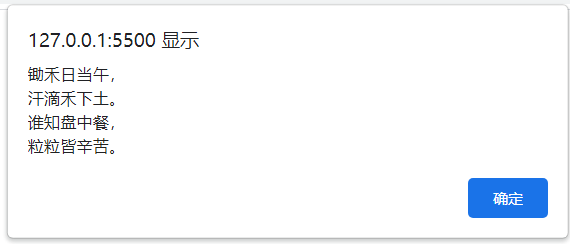

[TOC]


#### 数据类型

同python一样，在变量声明时不需要对其定义类型，而是系统根据其值来对其进行定义


##### 数据类型可变

JavaScript拥有动态类型，同时也就意味着相同的变量可用作不同的类型

```js
var a = 1;//数字型
a = "你好";//字符串型
document.write(a);
```

```
你好
```


#### 简单数据类型

| 简单数据类型 | 说明                       | 默认值    |
| ------------ | -------------------------- | --------- |
| Number       | 数字型，包含整型和浮点型   | 0         |
| Boolean      | 布尔型                     | false     |
| String       | 字符串                     | ""        |
| Undefined    | 声明但不赋值               | undefined |
| Null         | 声明a为控制，var a = null; | null      |


#### 数字型Number

有整型、浮点型、十进制、八进制、十六进制

##### 八进制

在数字前面加==0==表示八进制

```js
var num1 = 010;
document.write(num1);
```

```
8
```

##### 十六进制

在数字前面加==0x==表示十六进制

```js
var num1 = 0xa;
document.write(num1);
```

```
10
```

##### 数字型范围

JavaScript中数值的最大值和最小值

```js
document.write(Number.MAX_VALUE);//1.7976931348623157e+308
document.write(Number.MIN_VALUE);//5e-324，-324次方
```

##### 数字型三个特殊值

+ Infinity：代表无穷大
+ -Infinity：代表无穷小
+ NaN：Not a number，代表一个非数字

**方法isNaN()**

用来判断是否为非数字，是数字返回false，非数字则返回true

```js
document.write(isNaN(1));
document.write(isNaN("你好"));
```

```
false
true
```


#### 字符串型String

用单引号或双引号括起来

因为HTML标签里的属性使用的是双引号，所以js里更推荐使用==单引号==

##### 字符串引号嵌套

js可以嵌套引号，但是要==单嵌套双==，或者==双嵌套单==

```js
var str1 = '我是"程序猿"';
var str2 = "我是'程序猿'";
var str3 = "我是"程序员""//错误写法
var str4 = '我是'程序员''//错误写法
```


##### 字符串转义字符

转义字符都是==\\==开头的，并且都必须在==引号内==

举例：

```js
var xx = "我是一个\n程序员";
document.write(xx);//换行失败，显示空格
console.log(xx);//换行成功
```

```js
var xx = "我是一个程序员";
document.write(xx,"</br>",xx);
//document.write需要用"<br>"进行换行
```

| 转义字符 | 解释                     |
| -------- | ------------------------ |
| \n       | 换行符，n是newline的意思 |
| \\\      | 反斜杠\                  |
| \\\'     | 单引号                   |
| \\\"     | 双引号                   |
| \\t      | tab缩进                  |
| \\b      | 空格，b是blank的意思     |

例子

```js
alert('锄禾日当午，\n汗滴禾下土。\n谁知盘中餐，\n粒粒皆辛苦。');
```



##### 字符串长度及拼接

**length用来测量字符串长度**

```js
var myname = 'my name is Badboy';
document.write(myname.length);
```

```
17//空格也计算在内
```

**字符串拼接**

+ 多个字符串可以使用==+==进行拼接，拼接方式为==字符串+任何类型=拼接之后的新字符串==
+ 拼接时会把与字符串相加的任何类型转成字符串，再拼接成一个新字符串

例子：

```js
var str1 = '12';
var int1 = 12;
document.write(str1 + int1+'<br>');
document.write(int1 + int1);
```

```
1212
24
```


#### 布尔型Boolean

在参与运算时，true为1，false为0

```js
document.write(false + 1);//1
document.write(true + 1);//2
```


#### Undefined

+ 一个变量声明但未赋值时，默认值为undefined，等同于直接给变量值为undefined
+ 未定义＋字符串结果为字符串
+ 未定义＋数字结果为非数字

例子：

```js
var notdefind1;//声明未赋值
var notdefind2 = undefined;//直接给值
document.write(notdefind1);
document.write('<br>');
document.write(notdefind2);
```

```
undefined
undefined
```

再看看一下几个案例

```js
var notdefind1;//声明未赋值
document.write(notdefind1 + '你好');//未定义＋字符串结果为字符串
document.write('<br>');
document.write(notdefind1 + 1);//未定义＋数字结果为非数字
```

```
undefined你好
NaN
```


#### Null

+ 一个变量未声明未定义时默认值为null，等同于直接给值为null
+ 空值+字符串结果为字符串
+ 空值+数字结果为数字

```js
var blank = null;
document.write('你好'+blank);
document.write('<br>');
document.write(blank+1);
```

```
你好null
1
```


#### 检测变量的数据类型——typeof

==格式：==typeof 空格 变量

```js
var age = 18;
document.write(typeof age);
```

```
number
```

比较特殊的是有

```js
var age = null;
document.write(typeof age);//object
```

```js
var age2 = undefined;
document.write(typeof age);//undefined
```


#### 数据类型转换

使用==表单==、==prompt==获取过来的数据默认都是字符串类型，此时就不能直接简单进行加法运算，而需要转换变量的数据类型。

##### 转换为字符串

| 方式                | 说明                         | 案例                                |
| ------------------- | ---------------------------- | ----------------------------------- |
| .toString()         | 转成字符串                   | var num = 1; alert(num.toString()); |
| String(num)强制转换 | 转成字符串                   | var num = 1; alert(String(num));    |
| 加号拼接字符串      | 和字符串拼接的结果都是字符串 | var num = 1; alert(num+'');         |

需要注意的是，这三种方法并不会改变变量的本质类型，原来是整型，操作完后仍为整型，只在使用时为字符串型，除非重新赋值

**不改变**

```js
var num = 1;//当前类型为number
String(num);
num.toString();
num+'';
document.write(typeof num);//number
```

**改变**

```js
var num = 1;
num = num+'';
document.write(typeof num);//string
```


##### 转换为数字型

| 方式                    | 说明                             | 案例                |
| ----------------------- | -------------------------------- | ------------------- |
| parseInt(string)函数    | 将string类型转成==整数数值型==   | parseInt('18');     |
| pareseFloat(string)函数 | 将string类型转成==浮点数值型==   | parseFloat('3.14'); |
| Number()强制转换函数    | 将string转换为==数值型==         | Number('12');       |
| js隐式转换(- * /)       | 利用算术运算隐式转换为==数值型== | '12' - 0            |

同上，这几种在使用时也不会改变变量的本质类型，仅仅在使用时改变，操作完后仍为原来类型，除非重新赋值，才会使其类型发生本质改变

**不改变**

```js
var age = '18';//当前为string
Number(age);
document.write(typeof age);//string
```

**改变**

```js
var age = '18';//当前为string
age = Number(age);
document.write(typeof age);//number
```


###### **parseInt()**

取整，不进位

```js
parseInt('3.14');//结果为3
parseInt('3.94');//结果为3
parseInt('-3.14');//结果为-3
parseInt('-3.94');//结果为-3
=======================这是一个非常重要的功能=======================
    可以去掉数字后面的字母，但是字母开头的话会为NaN
parseInt('120px');//结果为120
parseInt('120asdasd');//结果为120
```


###### **parseFloat()**

与parseInt基本是类似的，也是可以去数字后面字母

```js
parseFloat('120d213sah');//结果为120
parseFloat('3.14');//结果为3.14
parseFloat('das120d213sah');//结果为NaN
```


###### **Number()**

感觉与parseFloat类似，只是不能去单位

```js
Number('3.14');//结果为3.14
Number('3.14sad');//结果为NaN
```

不过Number()有一个特殊的地方就是可以转换布尔型，其他三个都不行

举例：

```js
document.write(Number(false));//结果为0
document.write(parseFloat(false));//结果为NaN
document.write(parseInt(false));//结果为NaN
document.write(false + '0');//结果为false0
```


###### **- * /**

减号可以理解为字符串连接的逆，字符串+任何都为字符串，那字符串减字符串就是数字了

总结就是，==加==号被字符串占有，==减乘除==被数字占有

```js
document.write('3.14' - 0);//结果为3.14
document.write('100' - '1');//结果为99
document.write('50' * '2');//结果100
document.write('50' / '3');//结果16.666666666666668
```


##### 转换为布尔型

| 方式          | 说明               | 案例            |
| ------------- | ------------------ | --------------- |
| Boolean()函数 | 其他类型转为布尔值 | Boolean('true') |

+ 代表==空的、否定的值==都会被转为==false==，比如==' '、0、NaN、null、undefined==
+ 其余值会被转为==true==
