#### Web APIs和JS的关联

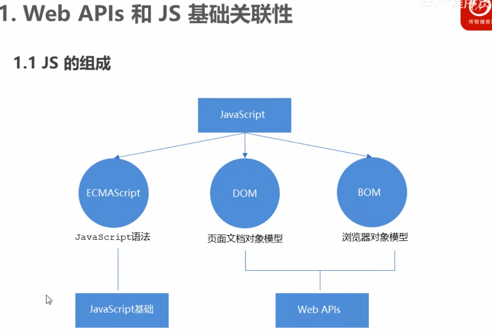


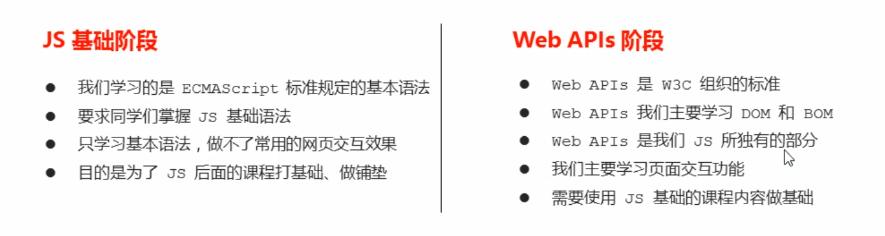

JS基础学习ECMAScript基础语法为后面作铺垫，Web APIs是JS的应用，大量使用JS基础语法做交互效果

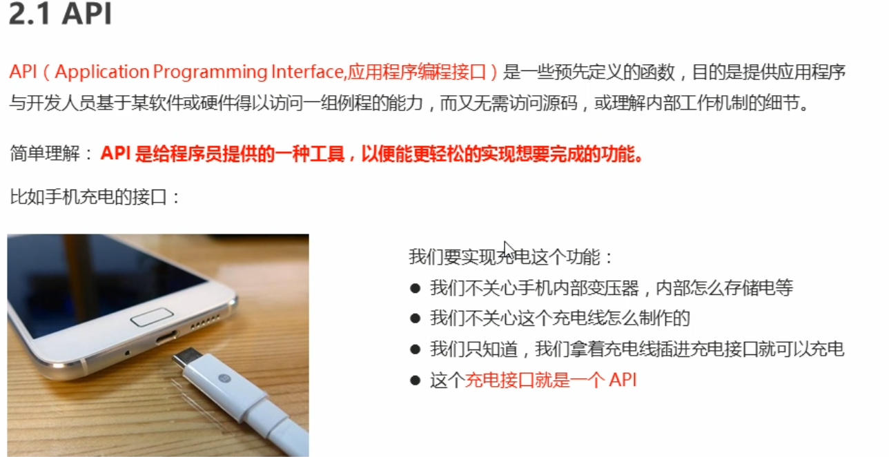

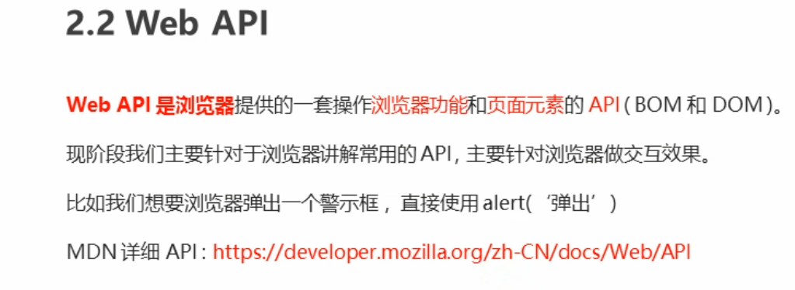

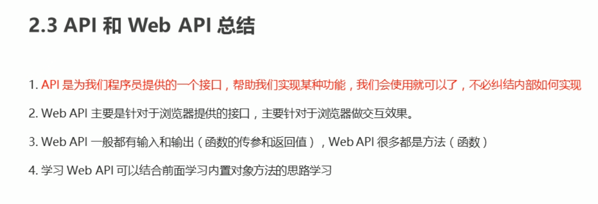

#### DOM

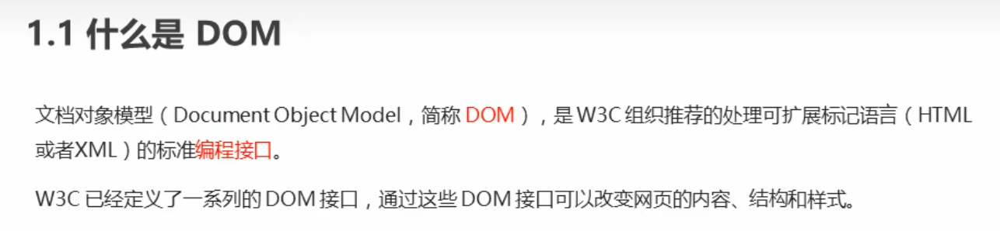


#### 如何获取页面元素

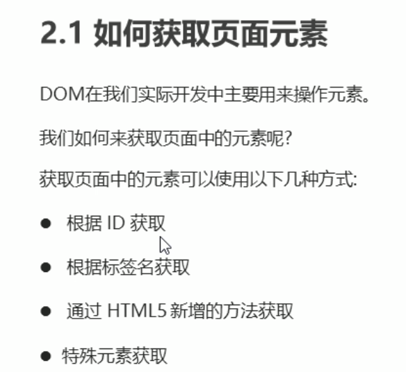

#### 根据ID获取

使用==getElementById()==方法可以获取带有ID的元素对象

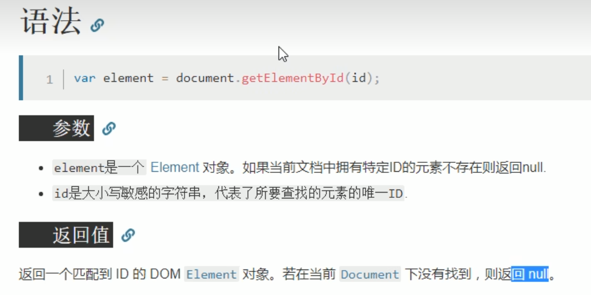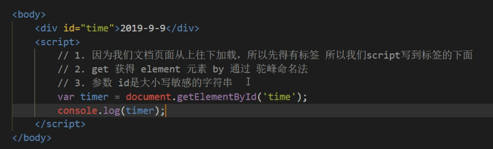

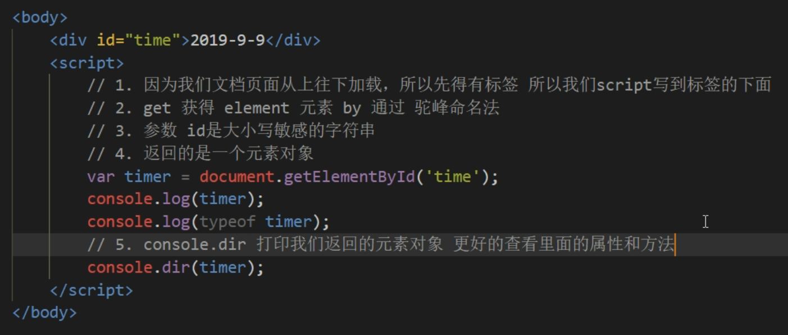


#### 根据标签名获取

通过==getElementsByTagName()==方法可以返回带有指定标签名的==对象的集合==

若找不到标签名，则返回==空的伪数组==

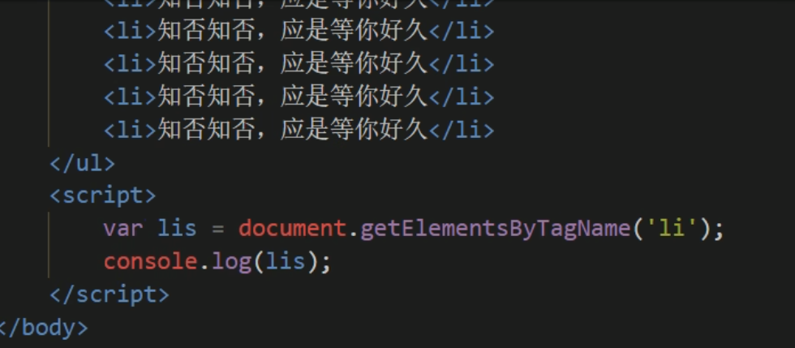

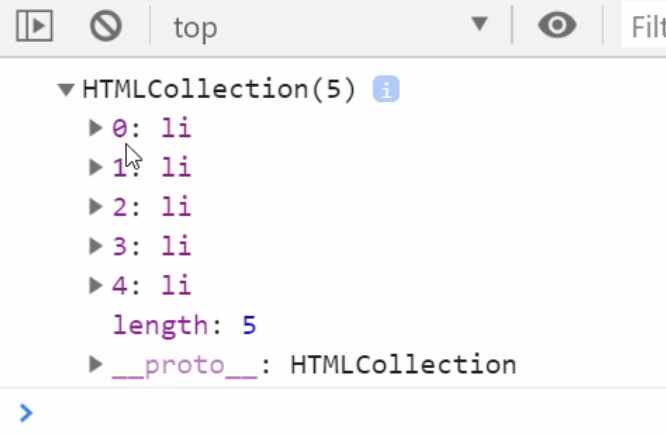

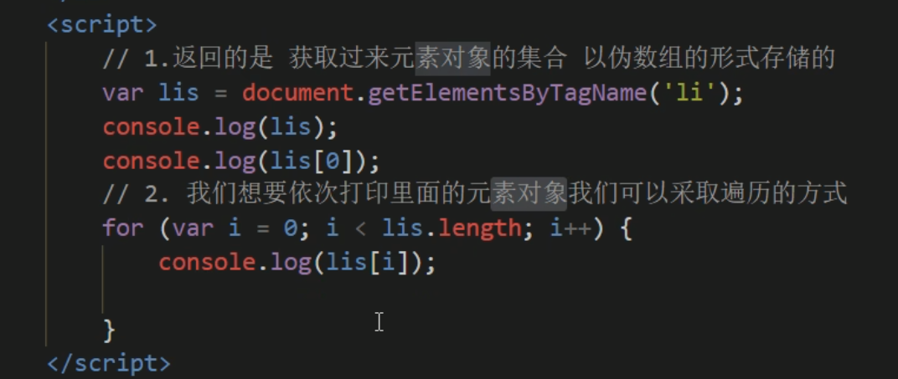

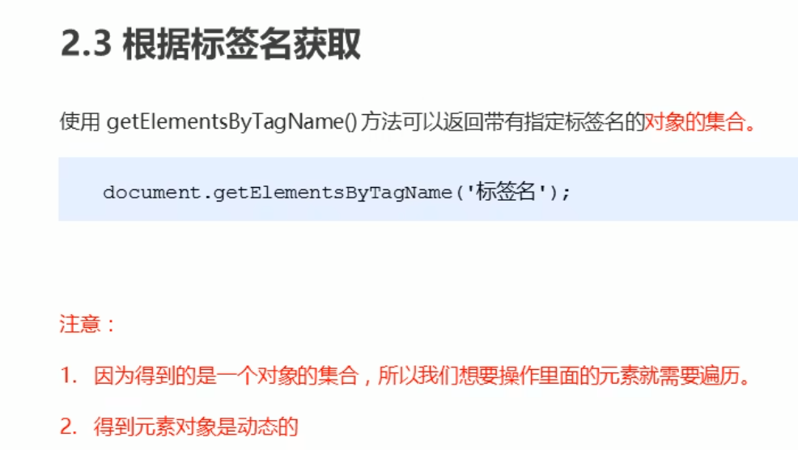

##### 获取某个父元素下的子标签

比如ul-li跟ol-li，只要获取ol里面的li标签

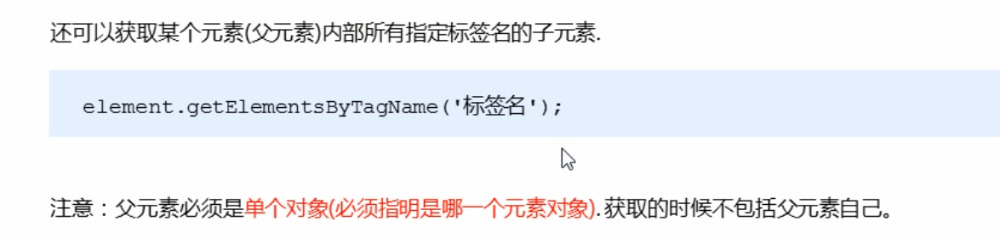

**例子**

```html
<body>

    <ol>
        <li>1</li>
        <li>2</li>
        <li>3</li>
        <li>4</li>
        <li>5</li>
    </ol>

    <ul>
        <li>6</li>
        <li>7</li>
        <li>8</li>
    </ul>

    <script>
        var ols = document.getElementsByTagName('li');
        //获取的ols是一个伪数组，但是用于获取子标签必须是单个对象
        //所以要用数组元素的方式进行使用
        console.log(ols[0].getElementsByTagName('li'));
    </script>

</body>
```

或者是为ol指定id，然后ols = getid，直接(ols.getElementsByTagName('li')也可以


#### 通过HTML5新增的方法获取

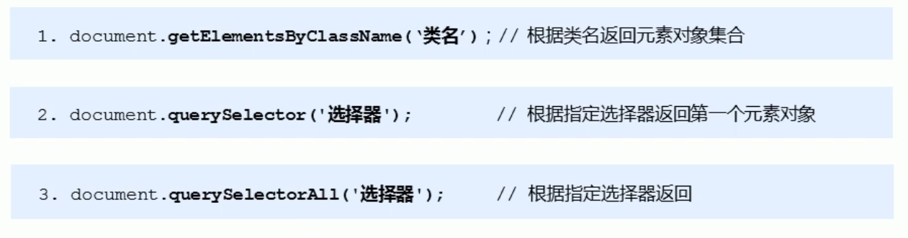

```
document.getElementsByClassName('类名');//根据类名返回元素对象集合
```

##### getElementsByClassName

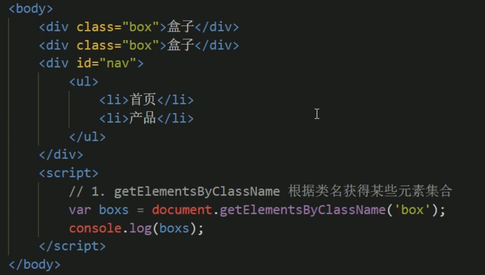

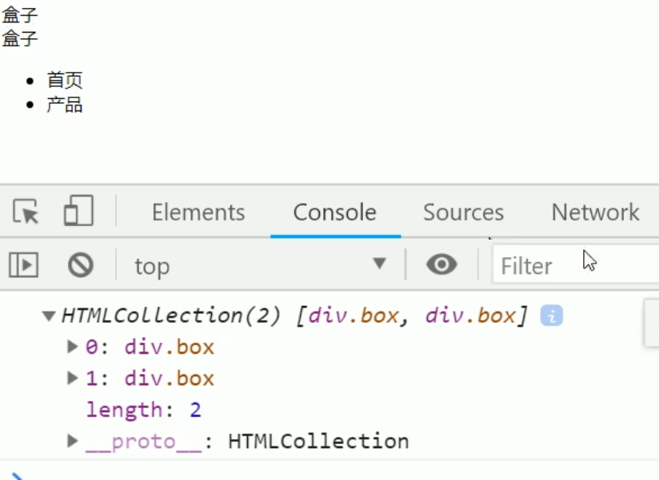

##### querrySelector

什么选择器都可以选

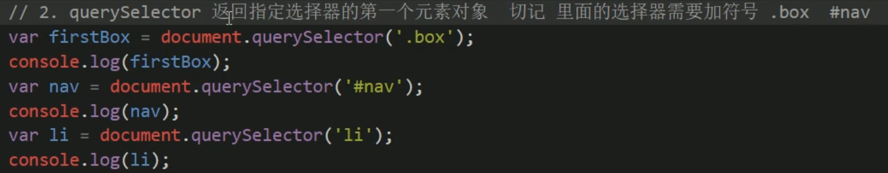

##### querrySelectorAll

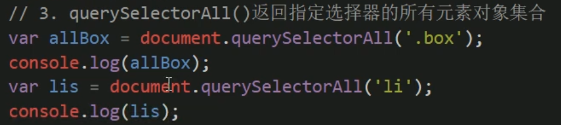